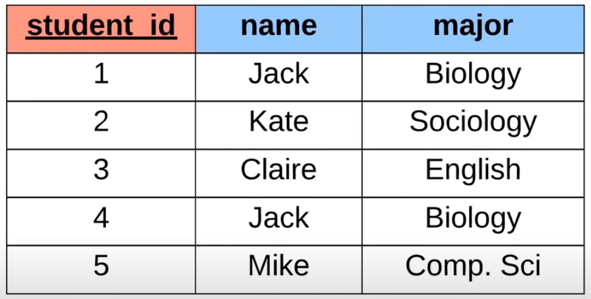
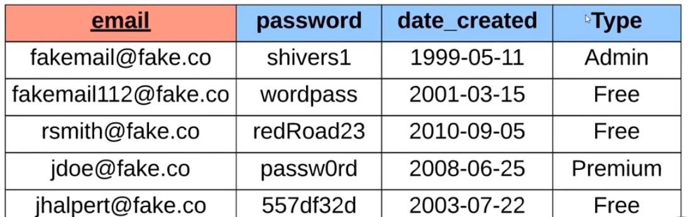
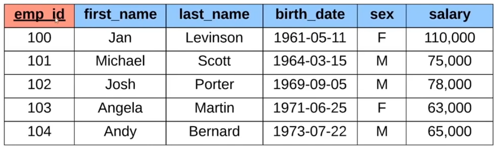
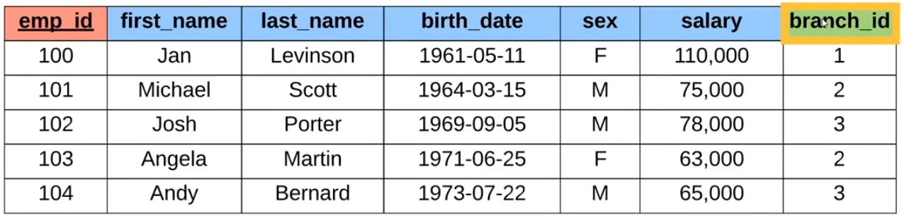
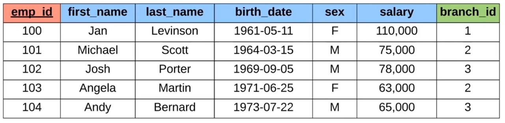
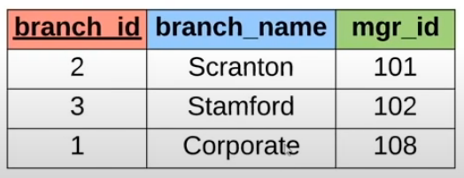

# O que é um banco de dados?

Um banco de dados é basicamente qualquer coleção de dados relacionados.
	

Por exemplo:

* Uma lista telefônica

* Uma lista de tarefas

* Base de usuários do Facebook

* Uma lista de compras

Todos os itens citados acima são coleções de dados relacionados. Por exemplo, a lista telefônica armazena o nome e o número de uma pessoa, há uma coleção de dados agrupados.

Banco de dados podem ser armazenados de diferentes formas:

* Em um papel

* Na sua mente

* Em um computador

Por exemplo, uma lista com os seus cinco melhores amigos estão armazenados em sua mente.


## A Amazon armazena trilhões de informações

* Armazenam informações como produtos, reviews, pedidos, usuário etc.

* Todas as informações são armazenadas em um computador, computadores são excelentes em armazenar informações.

# Sistema de gerenciamento de banco de dados(SGBD ou DBMS)

* SGBD é basicamente um software que nos permite criar e gerenciar o nosso banco de dados de forma especial, ele facilita o gerenciamento de forma fácil.

* Além disso, o SGBD ajudam a lidar com a segurança dos dados, onde apenas quem tem a senha de acesso pode fazer uso do SGBD.

* Ajuda a fazer backup dos seus dados, e ajuda no processo de importar/exportar dados.

* Por exemplo a Amazon faz uso de um SGBD para processar informações em seu site, onde informações são enviadas e recebidas.

# CRUD

CRUD é uma sigla que significa:
* CREATE:
	* Criar

* READ:
	* Ler

* UPDATE:
	* Atualizar

* DELETE:
	* Excluir

CRUD representa as quatros principais operações que são feitas em um banco de dados.

# Dois tipos de banco de dados

Os dois principais tipos de banco de dados são:

* Banco de dados relacionais(SQL)
	* Basicamente organiza os dados em uma ou mais tabelas.
	
	* Cada tabela há linhas e colunas.

	* Possui uma chave de identificação única para cada linha.

* Banco de dados não relacionais(noSQL)
	* Basicamente organiza os dados de uma forma diferente, o que foge da tabela tradicional.

	* Por exemplo, armazenam informações em key-value(valores-chave), documentos(JSON, XML), gráficos e tabelas flexiveis.


# Sistema de gerenciamento de banco de dados relacionais(SGBDR ou RBDMS)

* Basicamente ajuda a criar e manter(gerenciar) um banco de dados relacional.
	* Alguns exemplos são: MySQL, Oracle, PostgreSQL, mariaDB, etc.

* SQL(Structured Query Language) ou Linguagem de Consulta Estruturada
	* É uma linguagem padronizada para interagir com sistemas de gerenciamento de dado relacional.

	* É uma linguagem utilizada para realizar operações CRUD e outras atividades administrativas do sistema.

	* É utilizada para definir tabelas e estruturas.


## Exemplo de banco de dados não relacional(noSQL)

O exemplo abaixo armazena os arquivos no formato JSON(JavaScript Object Notation)

```javascript
[{
    "_id": 1345,
    "name": "Douglas",
    "major": "Sistemas de informação"
}, {
    "_id": 2267,
    "name": "Mateus",
    "major": "Sociologia"
}, {
    "_id": 2453,
    "name": "Guilherme",
    "major": "Inglês"
}]
```

# Sistema de gerenciamento de banco de dados não relacionais(Em inglês: NRDBMS = Non-Relation Database Management Systems)

* Ajuda a usuários criar e manterem o seu banco de dados não relacional:
	* Exemplo: mongoDB, dynamoDB, firebase, etc.


* Especifico de implementação:
	* Não existe uma linguagem padrão para interagir com o sistema de gerenciamento de banco de dados não relacional.

	* A maioria dos NRDBMS irão implementar suas próprias linguagens para realizar operações CRUD.


# Consulta de banco de dados

* Queries(consultas) são requisições feitas para o sistema de banco de dados pedindo informações específicas.

* O google search é uma query.

# Tabelas e chaves(Tables and Keys)



* Note que nessa tabela temos 3 colunas, sendo elas:
    * student_id, name e major.

	* Nessa tabela estamos armazenando 3 informações sobre cada aluno.

	* Cada coluna terá apenas um atributo.

	* As linhas representam uma entrada ou um aluno real.

Sempre que estamos criando uma tabela em um banco de dados relacional, queremos ter uma coluna especial que é chamada de chave primária, basicamente ela define exclusivamente a linha no banco de dados. No exemplo acima, student_id é a nossa chave primária. No exemplo acima, temos o nome Jack aparecendo duas vezes, note que são informações iguais, nesse caso a chave primária atua fazendo com que cada informação tenha o seu próprio identificador(nesse caso 2 e 4 são os id's).

## Outro exemplo



Note que no exemplo acima a nossa chave primária está na coluna email, cada email é único e possui as suas devidas informações em cada linha.

## Outro exemplo



No exemplo acima a nossa chave primária é emp_id.

# Chave estrangeira

Uma chave estrangeira basicamente armazena a chave primária de uma linha em outra tabela do banco de dados.



## Exemplo detalhado

No exemplo abaixo Jan Levinson(emp_id = 100) possui uma branch_id como sendo 1, esse 1 é basicamente a chave primária da tabela branch_id(segunda imagem).





Em resumo, uma chave estrangeira nos permite definir relacionamentos entre as duas tabelas.

Podemos ter duas ou mais chaves primárias, que são chamadas de chaves compostas.

